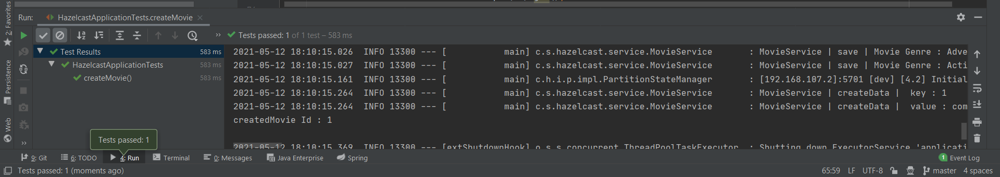
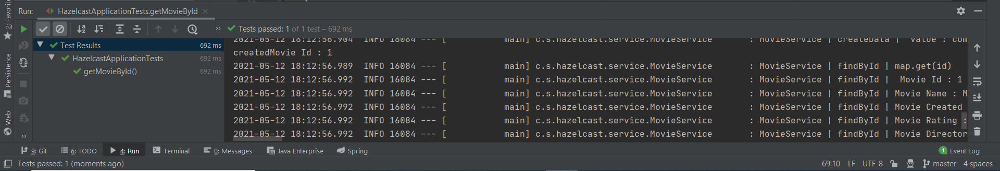
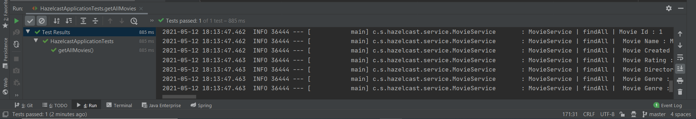
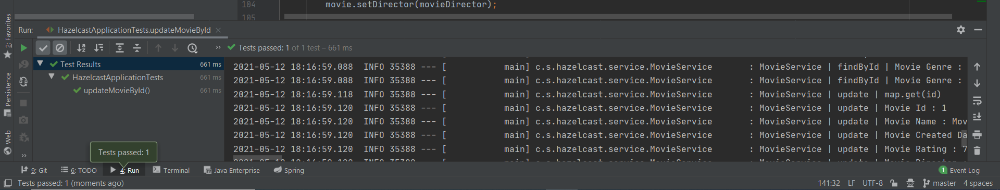
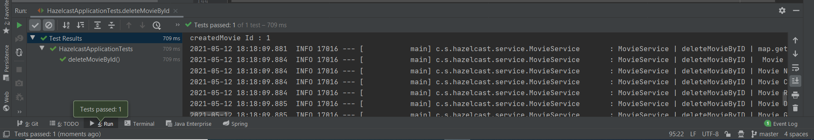
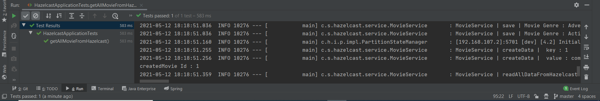

# Spring Boot and Hazelcast

### 📖 Information

<ul style="list-style-type:disc">
  <li>This project provides the usage of <b>Hazelcast</b> in Spring Boot</li>
  <li>The usage of <b>Hazelcast</b> is sensible as it reduces the query load on databases and helps improve application speed</li>
  <li>Through <b>Hazelcast</b>, it calls frequently used data along scalable data grid without calling it from database</li>
</ul>

### 🔨 Run the App

<b>1 ) Load Maven Dependency in <b>pom.xml</b> file </b> 

<b>2 ) Run the <b>app</b> 

<b>3 ) Call each test function in <b>HazelcastApplicationTests</b>  which is located under test folder</b> 

### Screenshots

Click here to show the screenshots of project

    
 Figure 1 

    
    
 Figure 2 

    
    
 Figure 3 

    
    
 Figure 4 

    
    
 Figure 5 

    
    
 Figure 6 

    

